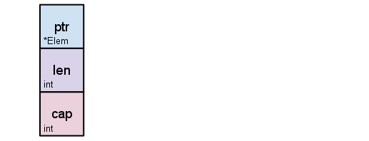
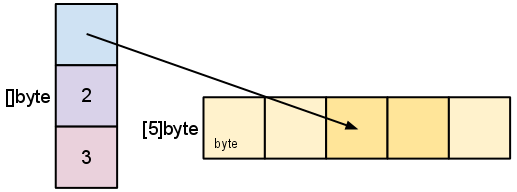

### go declaration syntax

go的type为什么在变量名后，即

```go
var x int
var y *int
```

而不是c style的

```c
int x;
int *y;
```

type在后是为了复杂/嵌套type时的可读性，对比

```c
f func(func(int,int) int, int) int
和
int (*fp)(int (*)(int, int), int)
```

详见 [https://blog.golang.org/declaration-syntax](https://blog.golang.org/declaration-syntax)

### 函数返回多个结果

```go
package main

import "fmt"

func swap(x, y string) (string, string) {
	return y, x
}

func main() {
	a, b := swap("hello", "world")
	fmt.Println(a, b)
}
```

### named return value

```go
package main

import "fmt"

func split(sum int) (x, y int) {
	x = sum * 4 / 9
	y = sum - x
	return // naked return, only used in short funcs(for readability)
}

func main() {
	fmt.Println(split(17))
}
```

### var

```go
package main

import "fmt"

var a, b bool // var declaration
var i, j int = 1, 2 // var declaration with initializers
var x, y = 20, "string!" // If an initializer is present, the type can be omitted

func main() {
  k := 3 // even `var` can be omitted, only inside functions
	fmt.Println(a, b, i, j, x, y)
}
```

### Constants

constants声明时必须赋值,之后不可改变。不能用var来给const赋值

### For

Go has only one looping construct, the `for` loop.

The basic `for` loop has three components separated by semicolons:

- the init statement: executed before the first iteration
- the condition expression: evaluated before every iteration
- the post statement: executed at the end of every iteration

The init statement will often be a short variable declaration, and the variables declared there are visible only in the scope of the `for` statement.

The init and post statements are optional.

```go
for ; sum < 1000; {
		sum += sum
}

//or
for sum < 1000 {
		sum += sum
}

// a forever loop
for {
}
```

### if

```go
v := math.Pow(x, n)
if v < lim {
	return v
} else {
	return lim
}

// declaration in if structure
if v := math.Pow(x, n); v < lim {
		return v
} else {
	return lim
}

// if ... else if ...
if num := 9; num < 0 {
        fmt.Println(num, "is negative")
    } else if num < 10 {
        fmt.Println(num, "has 1 digit")
    } else {
        fmt.Println(num, "has multiple digits")
    }

```

### switch

```go
package main

import (
	"fmt"
	"runtime"
  "time"
)

// switch变量不需要是常量，不需要是integer
func A() {
	fmt.Print("Go runs on ")
	switch os := runtime.GOOS; os {
	case "darwin":
		fmt.Println("OS X.")
	case "linux":
		fmt.Println("Linux.")
	default:
		// freebsd, openbsd,
		// plan9, windows...
		fmt.Printf("%s.\n", os)
	}
}

// switch true 可以当if ... else if ...用，更简洁
func B() {
	t := time.Now()
	switch {
	case t.Hour() < 12:
		fmt.Println("Good morning!")
	case t.Hour() < 17:
		fmt.Println("Good afternoon.")
	default:
		fmt.Println("Good evening.")
	}
}
```

### defer

所在function结束前才执行。可以用在file的关闭上。

defer语句涉及的变量在执行到defer语句（上下文顺序）时evaluated

defer可以读取所在function的返回值,下面这个函数返回2

```go
func c() (i int) {
    defer func() { i++ }()
    return 1
}
```

### pointers

[https://tour.golang.org/moretypes/1](https://tour.golang.org/moretypes/1)

### array

array是定长的，`var a [10]int`

Go's arrays are values. 

An array variable denotes the entire array; it is not a pointer to the first array element (as would be the case in C). 

This means that when you assign or pass around an array value you will make a copy of its contents. (To avoid the copy you could pass a pointer to the array, but then that's a pointer to an array, not an array.) 

One way to think about arrays is as a sort of struct but with indexed rather than named fields: a fixed-size composite value.

### slice

slice是array的区域引用。slice由一个pointer，2个int（length和capacity）组成。length就是slice的长度，cap是从slice的第一个元素开始，直到引用array的最后一个元素



pointer指向slice的第一个元素， `s = a[2:4]`如下所示



```go
primes := [6]int{2, 3, 5, 7, 11, 13}
var s []int = primes[1:4]
fmt.Println(s) // [3 5 7]

// slice literal
r := []bool{true, false, true, true, false, true}
fmt.Println(r)
```

所以后截断不影响capacity，前截断影响。下面的例子只有s[2:]改变了cap

```go
s := []int{2, 3, 5, 7, 11, 13} //len=6 cap=6 [2 3 5 7 11 13]

// Slice the slice to give it zero length.
s = s[:0] // len=0 cap=6 []

// Extend its length.
s = s[:4] // len=4 cap=6 [2 3 5 7]

// Drop its first two values.
s = s[2:] // len=2 cap=4 [5 7]
```

用slice实现动态数组(To increase the capacity of a slice one must create a new, larger slice and copy the contents of the original slice into it.)

```go
b := make([]int, 0, 5) // len(b)=0, cap(b)=5
```

`func copy(dst, src []T) int` 可以拷贝slice（值拷贝，会复制一遍背后的array）。这在要从一个很大的array中提取部分时很有用。如果slice背后的array很大，占用大量内存，copy一个slice，然后再使用copy后的slice，原array就可以被gc释放掉了

```go
var digitRegexp = regexp.MustCompile("[0-9]+")

func CopyDigits(filename string) []byte {
    b, _ := ioutil.ReadFile(filename)
    b = digitRegexp.Find(b)
    c := make([]byte, len(b))
    copy(c, b)
    return c
}
```

用append添加元素，当超过capacity时，会自动allocate新的内存空间(函数内部操作和copy是类似的，如果超出cap，先make一个slice，然后copy，然后append)

```go
package main

import "fmt"

func main() {
	var s []int
	printSlice(s)

	// append works on nil slices.
	s = append(s, 0)
	printSlice(s)

	// The slice grows as needed.
	s = append(s, 1)
	printSlice(s)

	// We can add more than one element at a time.
	s = append(s, 2, 3, 4)
	printSlice(s)
}

func printSlice(s []int) {
	fmt.Printf("len=%d cap=%d %v\n", len(s), cap(s), s)
}
```
